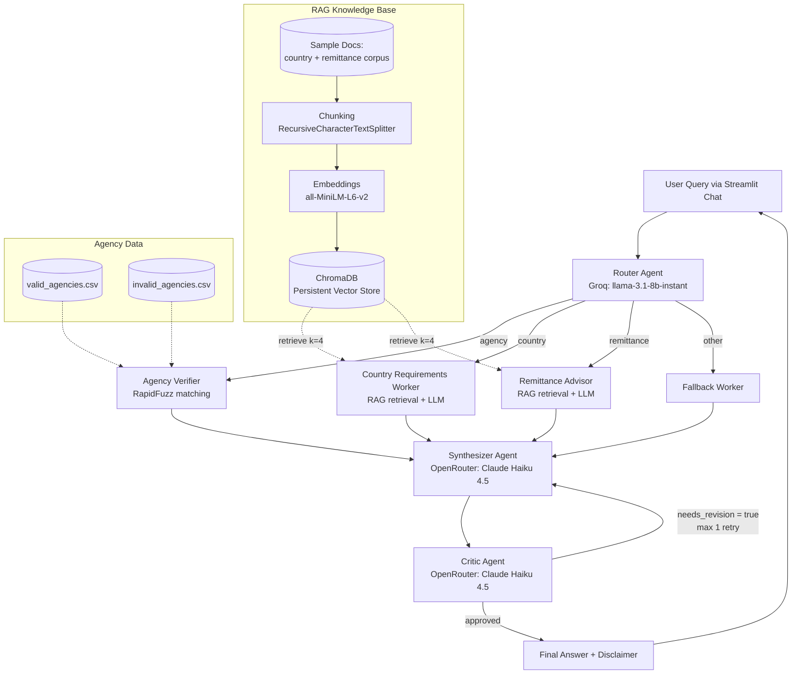
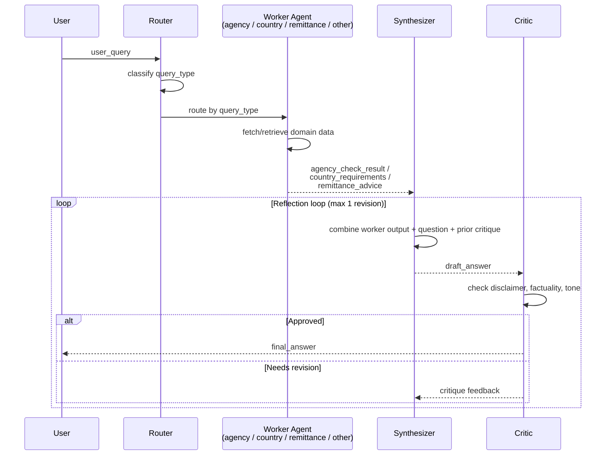

# 🧳 Sri Lanka Foreign Employment Advisory Agent

A multi-agent AI advisory system that helps Sri Lankan migrant workers and job seekers get reliable guidance on **recruitment agency verification**, **destination-country legal requirements**, and **remittance planning** — built with LangGraph, RAG, and a router → worker → synthesizer → critic pipeline.

---

##  Developer Information

* **Developer Name:** S.M.K.S De Silva
* **Developer Index:** ITBIN-2313-0020
* **Project:** Sri Lanka Foreign Employment Advisory Agent

---

##  Project Description

Every year, thousands of Sri Lankans seek foreign employment through licensed recruitment agencies, and many fall victim to unregistered or fraudulent agencies, unclear visa/legal requirements, or costly remittance mistakes. This project builds an **AI advisory agent** that answers natural-language questions across three domains:

- **Agency Verification** — checks whether a recruitment agency is SLBFE-registered, suspended, or cancelled, using fuzzy matching against official SLBFE agency lists.
- **Country Requirements** — answers questions about visa rules, labor laws, and legal requirements for specific destination countries, grounded in a retrieval-augmented (RAG) knowledge base.
- **Remittance Planning** — advises on sending money home, tax implications, and CBSL (Central Bank of Sri Lanka) forex rules, also grounded in RAG.

The system routes each query to the correct specialist agent, synthesizes a combined answer, and runs it through a **self-critique loop** before returning a final, disclaimer-backed response — always pointing users back to official sources (SLBFE, embassies, CBSL) for final verification.

---

##  Architecture Diagram



**Deployment stack:** Google Colab (compute) → Streamlit (UI) → LocalTunnel (public URL) → GitHub (version control, feature-branch workflow).

---

##  Setup Instructions

### Prerequisites
- Python 3.10+
- A [Groq API key](https://console.groq.com/keys) (free tier available)
- An [OpenRouter API key](https://openrouter.ai/settings/keys) with credits

### 1. Clone the repository
```bash
git clone https://github.com/Kaveesha358/migration-advisory-agent.git
cd migration-advisory-agent
```

### 2. Install dependencies
```bash
pip install -r requirements.txt
```

### 3. Configure secrets
Create `.streamlit/secrets.toml` (this file is git-ignored — never commit real keys):
```toml
GROQ_API_KEY = "your-groq-key-here"
OPENROUTER_API_KEY = "your-openrouter-key-here"
```

Or, for local/non-Streamlit runs, create a `.env` file:
```env
GROQ_API_KEY=your-groq-key-here
OPENROUTER_API_KEY=your-openrouter-key-here
```

### 4. Build the knowledge base index
```bash
PYTHONPATH=. python rag/ingest.py
```

### 5. Run the app
```bash
streamlit run app.py
```

### 6. (Optional) Expose publicly from Colab
```python
!streamlit run app.py --server.port 8501 &
!npx localtunnel --port 8501
```

---

##  Model-Choice Comparison Table

| Role | Model | Provider | Why this model |
|---|---|---|---|
| **Router** (query classification) | `llama-3.1-8b-instant` | Groq | Extremely fast + free-tier friendly; classification is a simple single-word task that doesn't need a large model, so a lightweight model keeps routing latency near-instant. |
| **Synthesizer** (combines worker outputs into a draft answer) | `anthropic/claude-haiku-4.5` | OpenRouter | Strong instruction-following and coherent writing at low cost/latency; needed to merge multiple worker outputs into one clear, well-structured response. |
| **Critic** (reflection / quality-control pass) | `anthropic/claude-haiku-4.5` | OpenRouter | Same model reused for consistency of judgment; cheap enough to run a second full pass per query without materially increasing cost, while still being capable of catching missing disclaimers or unverified claims. |
| **Embeddings** (RAG retrieval) | `all-MiniLM-L6-v2` | Sentence-Transformers (local) | Small, fast, runs locally with no API cost — ideal for chunk-level semantic search over a modest-sized document corpus. |


---

##  Agent Communication Diagram

The agents communicate through a **shared `MigrationAgentState`** (a `TypedDict`) that flows through the LangGraph graph — each node reads what it needs from state and writes back only its own fields.



**Shared state fields:** `user_query`, `query_type`, `agency_check_result`, `country_requirements`, `remittance_advice`, `draft_answer`, `critique`, `needs_revision`, `revision_count`, `final_answer`.

A separate **parallel fan-out graph** (`agents/parallel_search.py`) exists for queries that touch both country and remittance topics at once — both workers run concurrently from `START`, then converge on the synthesizer.

---

##  RAG Pipeline Explanation

The country-requirements and remittance-advisor agents are grounded using a Retrieval-Augmented Generation pipeline so answers stay tied to actual source documents rather than the model's unverified memory:

1. **Ingestion** (`rag/ingest.py`) — reads `.txt` and `.pdf` files from `data/sample_docs/`, and auto-tags each document with metadata (`doc_type`: agency / country / remittance, `country`, `source_file`) inferred from the filename.
2. **Chunking** (`rag/chunking.py`) — splits each document into overlapping chunks (`chunk_size=2400`, `chunk_overlap=400`) using `RecursiveCharacterTextSplitter`, preserving paragraph/sentence boundaries where possible.
3. **Embedding & Indexing** (`rag/vectorstore.py`) — each chunk is embedded with the local `all-MiniLM-L6-v2` sentence-transformer model and stored in a **persistent ChromaDB collection** (`chroma_db/`), so the index only needs to be built once.
4. **Retrieval** — at query time, `retrieve(query, k=4, where={"doc_type": ...})` performs a metadata-filtered similarity search, returning the top-4 most relevant chunks scoped to the correct domain (e.g. only `remittance`-tagged chunks for remittance questions).
5. **Grounded generation** — the retrieved chunks are injected into the worker agent's prompt as `Context`, and the LLM is instructed to answer **using only that context**, reducing hallucination.

---

##  Live Demo

**Streamlit App:**  [https://migration-advisory-agent-ilzv3dtf62d5tyeb2efjun.streamlit.app/](https://migration-advisory-agent-ilzv3dtf62d5tyeb2efjun.streamlit.app/)


---

##  Known Limitations

- **Ephemeral hosting** — the current deployment runs on Google Colab + LocalTunnel, so the public URL changes on every restart and the app goes offline when the Colab session disconnects (idle timeout / max runtime).
- **Small, sample-only agency dataset** — `valid_agencies.csv` and `invalid_agencies.csv` contain a limited sample of SLBFE agency records (not the full live registry), stored as raw semi-structured text rather than clean tabular data. Agency verification results should always be double-checked at [slbfe.gov.lk](https://slbfe.gov.lk).
- **Limited knowledge corpus** — the RAG pipeline is only as good as the documents placed in `data/sample_docs/`; country and remittance answers will return "No relevant context found" for topics not covered by the seeded corpus.
- **No live data feeds** — the system does not call any live SLBFE, embassy, or CBSL APIs; all information is static/sample data and can become outdated.
- **Cost/rate limits** — OpenRouter free-tier credits cap `max_tokens` at a modest value (2048), which can truncate very long synthesized answers; the critic's revision loop is capped at 1 retry to control cost.
- **Not legal advice** — all responses include a disclaimer and are for informational guidance only; they are not a substitute for verification with SLBFE, the relevant embassy, or a qualified immigration/legal professional.
- **Single-turn context per query** — while chat history is displayed in the UI, each query is currently processed independently by the graph (the agents do not use prior conversation turns as additional context).

---

##  Project Structure

```
migration-advisory-agent/
├── agents/
│   ├── state.py              # Shared LangGraph state schema
│   ├── router.py              # Query classification agent
│   ├── agency_verifier.py     # SLBFE agency lookup (fuzzy match)
│   ├── country_requirements.py# RAG worker for country/visa rules
│   ├── remittance_advisor.py  # RAG worker for remittance rules
│   ├── synthesizer.py         # Combines worker outputs + disclaimer
│   ├── critic.py              # Reflection / quality-control agent
│   ├── graph.py               # Main LangGraph pipeline
│   └── parallel_search.py     # Fan-out graph for combined queries
├── models/
│   └── llm_config.py          # Centralized LLM provider config
├── rag/
│   ├── chunking.py
│   ├── vectorstore.py
│   └── ingest.py
├── data/
│   ├── sample_docs/
│   ├── valid_agencies.csv
│   └── invalid_agencies.csv
├── tests/
│   └── test_retrieval_eval.py
├── app.py                     # Streamlit chat interface
└── requirements.txt
```

---

## 📄 License & Disclaimer

This is an educational/informational tool. It is **not affiliated with SLBFE** and does not replace official verification channels. Always confirm agency status and legal requirements directly with [SLBFE](https://slbfe.gov.lk), the relevant embassy, or the Central Bank of Sri Lanka.
>
